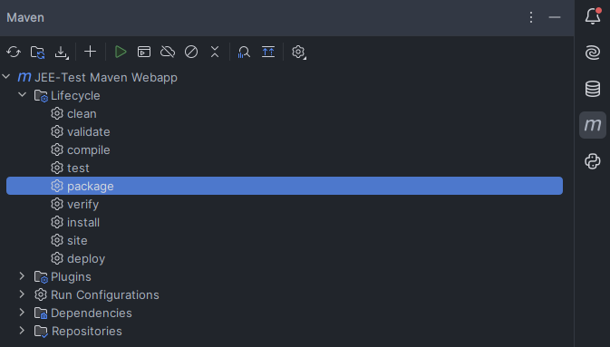
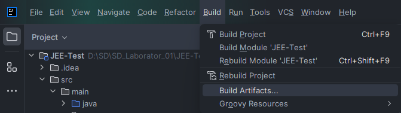
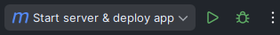
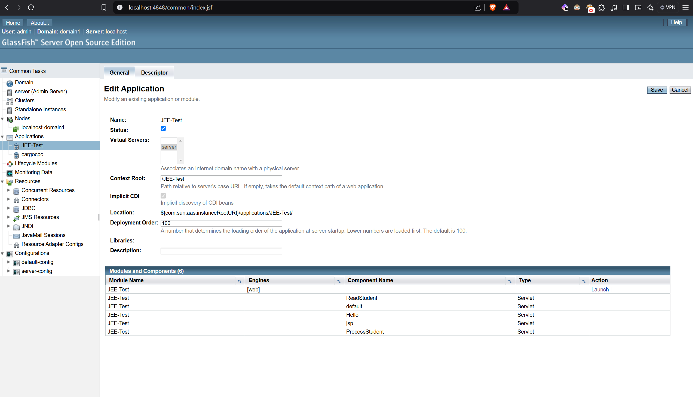
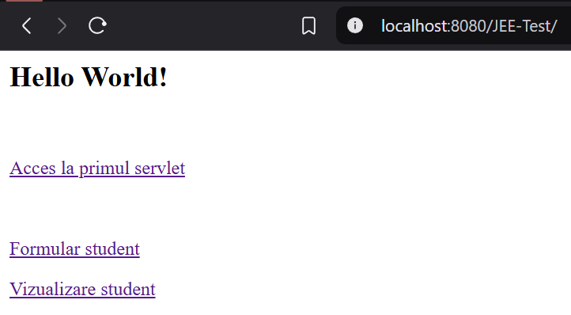

# SD Laborator 01

Pentru a usura lucrul la acest laborator am pregatit un proiect de IntelliJ pe care-l puteti doar deschide si rula proiectul.
Server-ul glassfish va fi instalat automat de IDE si rulat.

Inainte de asta trebuie setate totusi urmatoarele:

## config.properties
Setati in fisierul `src/main/resources/config.properties` calea catre un director unde se vor serializa studentii stocati de aplicatie.

```java
students.path=D:\\SD\\SD_Laborator_01\\students
```
## Maven package
Pentru a construi fisierul `.war` care contine aplicatia noastra putem naviga in dreapta la maven -> Lifecycle -> package. Ca urmare ar trebui sa avem fisierul `target/JEE-Test.war`. Fara acest fisier target-ul de `Redeploy` nu va functiona. Similar avem target-ul `Start server & deploy app` care ne porneste si server-ul de glassfish automat si ne da si deploy la `JEE-Test.war` pe server-ul respectiv.



## Build Artifacts (alternativa la Maven package)

Din IntelliJ, intrati in Build -> Build Artifacts si selectati All Artifacts. Ulterior dupa build, in `target/` ar trebui sa fi aparut un fisier `JEE-Test.war`. Aceasta este arhiva cu codul nostru, care va fi trimisa la glassfish si servita.




## Rularea serverului de Glassfish

In proiect este deja disponibila o configuratie pentru a porni server-ul si a da deploy la fisierul `war` in cadrul serverului.



Ulterior pe http://localhost:8080 va fi disponibil server-ul de glassfish.
Pe http://localhost:4848 avem disponibila consola de administrator accesibila doar cu username-ul `admin`.



Consola de admin ne indica ca aplicatia noastra este servita de glassfish la ruta `/JEE-Test`



De aici putem interactiona cu aplicatia noastra. 

Atunci cand modificam codul trebuie doar sa urmam iar pasii de la [Maven package](#maven-package) / [Build Artifacts](#build-artifacts) si sa folosim configuratia de `Redeploy`.

Odata folosita configuratia `Start server & deploy app` server-ul ramane pornit si nu e necesar sa-l oprim si sa-l repornim. Noi doar impachetam aplicatia si ii dam redeploy.
Spor!