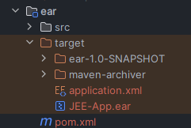
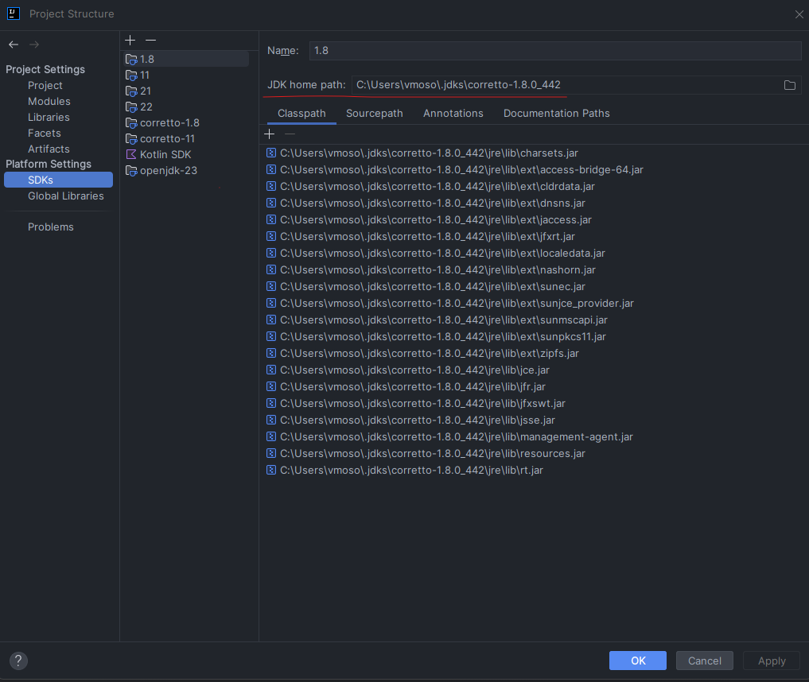
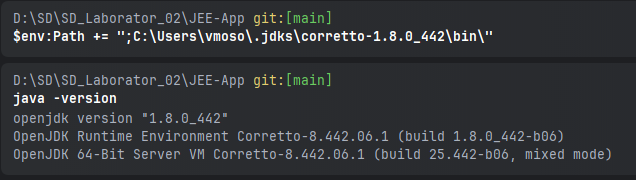

# SD Laborator 02

Laboratorul contine doua proiecte, le deschidem pe fiecare in fereasta lui separata de intellij. JEE-App reprezinta aplicatia principala ce va rula pe serverul Glassfish in timp ce JEE-Client este un client java ce va apela folosind RMI si EJBs metode expuse de aplicatia principala.

## JEE-App

### Server Glassfish

La fel ca-n laboratorul trecut avem deja o configuratie pentru descarca si rula glassfish automat.


Aceasta trebuie rulata o singura data la inceputul lucrului cu proiectul si ramane pornita cat timp lucram.


### Build ear file
In dreapta la `Maven -> Lifecycle -> compile` apasam pentru compilare si ulterior pe `Maven -> Lifecycle -> package` apasam pentru a impacheta proiectul intr-o arhiva de tip ear. In urma build-ului ar trebui sa fi aparut fisierul `./ear/target/JEE-App.ear`.

Alternativ, am adaugat o configuratie `Package` la proiect care ruleaza `compile` urmat de `package`.



### Deploy si redeploy

Pentru asta va fi putin mai complicat. In terminal este necesar sa aveti disponibila comanda `java`. Daca nu o aveti, o puteti adauga in path pe cea din intellij. Ca sa aflati unde se afla respectivul executabil de `java` intrati la File -> Project Structure -> SDKs si veti vedea acolo unde se afla JDK-ul.



In directorul `bin` din cel gasit mai sus avem executabilele necesare.
In functie de sistem trebuie acum sa actualizam variabila de mediu path astfel incat sa avem acces la java.

#### Exemplu windows
```pwsh
$env:Path += ";C:\Users\vmoso\.jdks\corretto-1.8.0_442\bin\"
```

#### Exemplu linux
```bash
export PATH=$PATH:/home/student/.jdks/corretto-1.8.0_442/bin
```

Ulterior ar trebui comanda java sa functioneze normal in aceasta sesiune de terminal.



Acest setup este necesar o singura data iar ulterior vom putea folosi acest terminal continuu pentru a da redeploy la aplicatie pe masura ce o modificam.

#### Deploy
Asta rulam doar prima data cand dam deploy la pachetul ear.

Daca ati lasat intellij sa va instaleze automat Glassfish si sa vi-l ruleze folosind configuratia de la punctul [Server Glassfish](#server-glassfish) atunci server-ul vostru a fost descarcat la `target\cargo\installs\glassfish-5.1.0`

Si atunci pentru deploy rulam asa:

```pwsh
target\cargo\installs\glassfish-5.1.0\glassfish5\bin\asadmin deploy .\ear\target\JEE-App.ear
```

#### Redeploy

Asemanator ca mai sus, dupa ce dam build cum am aratat la sectiunea [Build ear file](#build-ear-file).

rulam 

```pwsh
target\cargo\installs\glassfish-5.1.0\glassfish5\bin\asadmin redeploy --name JEE-App .\ear\target\JEE-App.ear
```

### Mod de lucru

Odata pornit serverul glassfish nu mai e nevoie sa umblam la el. Cand modificam aplicatia trebuie doar urmatorii pasi sa-i urmam. 

1. [Build ear file](#build-ear-file).
2. [Redeploy](#redeploy)

## JEE-Client


In `File -> Project Structure -> Libraries` pentru biblioteca `gf-client` actualizati calea catre biblioteca astfel incat sa corespunda cu cea de pe server-ul vostru de Glassfish.