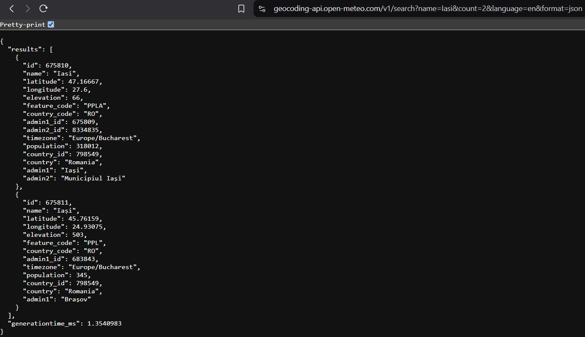
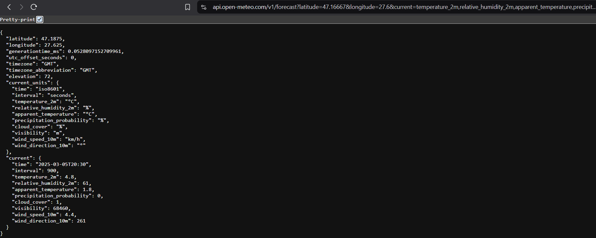

# SD Laborator 03

In acest laborator vom lucra cu aplicatii web scrise in Kotlin folosind framework-ul [Spring Boot](https://spring.io/projects/spring-boot), un framework extrem de puternic care vine cu multe features out-of-the-box. Avem un exemplu de build folosind gradle si unul folosind maven. 

## Weather App

Aplicatia de Weather se bazeaza pe un API care din pacate nu mai este functional. In mod normal se efectuau doua apeluri, unul in care se trimitea numele unei localitati si din care se returna un Id, Id care ulterior era trimis la alta ruta pentru a obtine prognoza meteo. Intrucat acel API nu mai este disponibil, va trebui sa modificati aplicatia data intrucat sa foloseasca urmatoarele API-uri.

### Geolocation API

```bash
https://geocoding-api.open-meteo.com/v1/search?name=${encodedLocationName}&count=2&language=en&format=json
```

In locul `$encodedLocationName` va trebui sa introduceti locatia primita prin parametru de catre metoda serviciului. Din acest raspuns va trebui sa extrageti coordonatele returnate pentru a le pasa la celalalt serviciu.

#### Exemplu de utilizare




### Weather API

```bash
https://api.open-meteo.com/v1/forecast?latitude=${coords.first}&longitude=${coords.second}&current=temperature_2m,relative_humidity_2m,apparent_temperature,precipitation_probability,cloud_cover,visibility,wind_speed_10m,wind_direction_10m
```


`coords` reprezinta coordonatele returnate de serviciul anterior.

#### Exemplu de utilizare




Pentru inceput modificati WeatherApp asa cum este precizat mai sus si dupa aceea puteti sa rezolvati cerintele din laborator.

Spor!